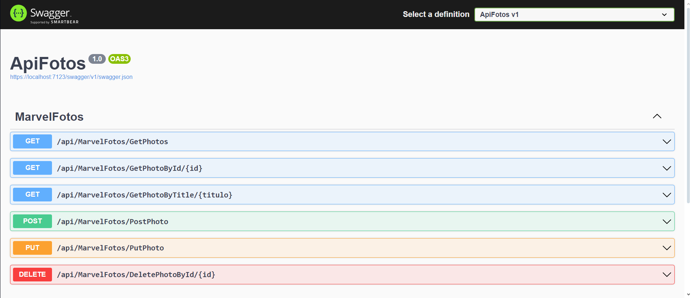
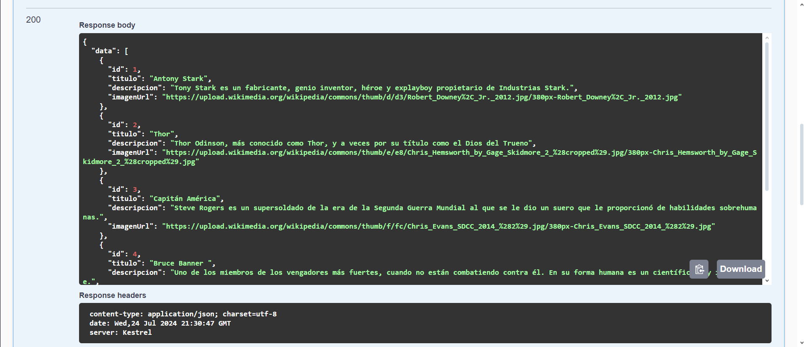
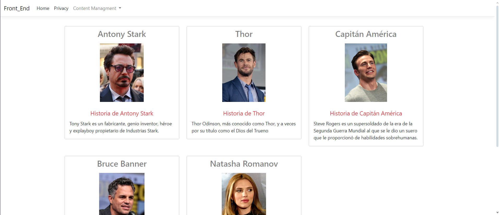
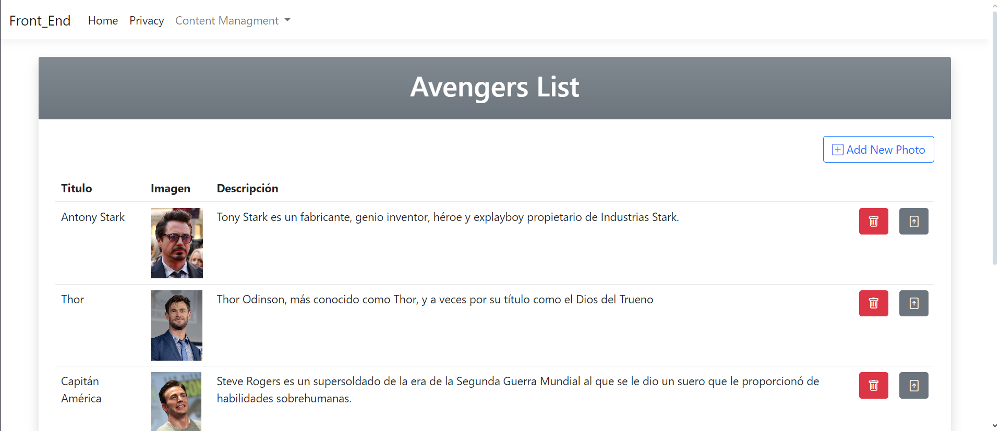
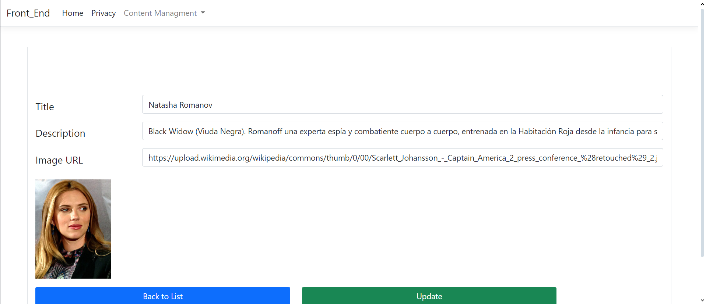

##  Consumo de API REST 

Este proyecto es una API REST desarrollada en C# para gestionar personajes de Marvel. La API permite realizar las operaciones básicas de un CRUD (Crear, Leer, Actualizar y Eliminar) para los registros de personajes.

### Descripción del Proyecto

- **Tecnología Backend:** La API está construida usando ASP.NET Core Web API.

 - **Base de Datos:** La base de datos está gestionada con Entity Framework Core utilizando el enfoque Code First.
 - **Motor de Base de Datos:** Microsoft SQL Server.
 - **Frontend:** El consumo de la API se realiza a través de una interfaz sencilla desarrollada con ASP.NET Core MVC y Bootstrap.

### Funcionalidades

**CRUD Completo:** Los usuarios pueden:
  - Leer los registros de personajes.
  - Modificar detalles de personajes existentes.
  - Crear nuevos registros de personajes.
  - Eliminar registros de personajes.

### Tecnologías utilizadas:
 1. Swagger
 2. .NET 6
 3.  Microsoft SQL Server
 4. Entity Framework Core
 5. ASP.NET Core Web API
 6. ASP.NET Core MVC
 7. Bootstrap

### Imágenes

 
